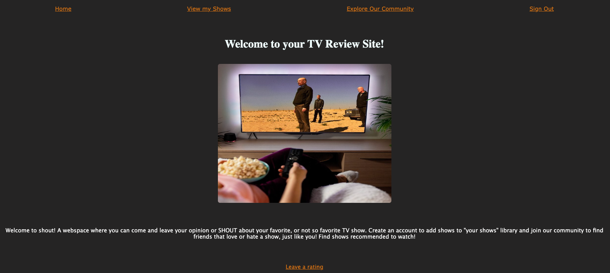
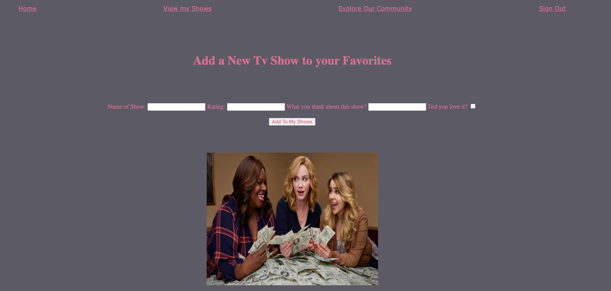
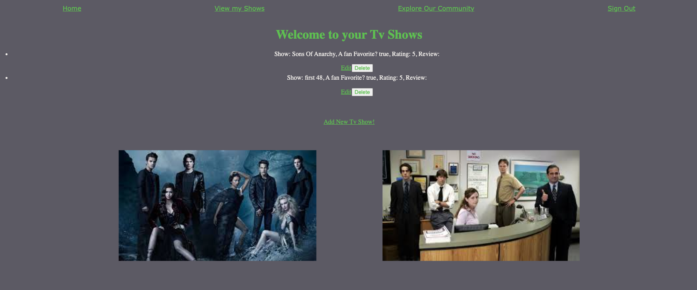

# project-2-tv-showss

The name of my app is Tv Shows, I named my app Shout as listed in the welcoming description on the landing page after you sign in. The purpose and functionality of my app is to first, create an account, sign in. You hit the landing page and there is a nav bar to explore, or a link under the photo to add a show to your account and leave a review/opinion about how you feel about the show you are speaking of. You can also edit or delete any of your shows/reviews. You can also go to the community page where you can see other users' usernames (email addresses), click on the link and then you can see the titles of the shows, rating and a commented review.

Stretch goals I would like for this app is to be able to become friends with other users, comment on other users reviews (comment section?), a user would able to add a picture each review. 

